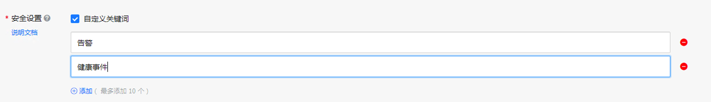

# DingTalk-Notifier

When using AWS, we occasionally receive notification emails in the administrator's inbox about EC2 maintenance information from AWS. These emails can easily get buried in the inbox and not be dealt with in a timely manner. Many customers hope to receive such messages more promptly, for example through instant messaging software like WeChat or DingTalk.

Instant messaging tools like WeChat and DingTalk provide message interfaces. After obtaining authorization, third-party applications can send messages to the client by calling these interfaces. On AWS, you can configure event rules in EventBridge/CloudWatch Events to trigger a Lambda function that runs the processing logic for WeChat/DingTalk interface calls. There are quite a few blogs and technical articles explaining this design, which you can refer to in the links in the appendix.

This project goes a step further by providing a quick deployment of DingTalk alert notification functionality without the need to write code. In the Serverless Application Repository, you can quickly deploy the entire set of DingTalk alert notification-related components by filling in the parameters related to the DingTalk robot interface. The AWS services involved include EventBridge, SNS, Lambda, and Secrets Manager. Below is the overall deployment architecture:

For demonstration purposes, this application creates two EventBridge Rules when deployed. One captures EC2 state change events (such as starting or stopping), and the other captures AWS Health events (such as EC2 planned maintenance events). Therefore, after deployment, you can simply start or stop an EC2 instance to check if you receive notifications in DingTalk.

## Creating a DingTalk Robot and Getting the Webhook URL

To configure a custom DingTalk robot, please refer to the [official instructions](https://open.dingtalk.com/document/robots/custom-robot-access)

Obtain the Webhook URL of the custom robot to use as a deployment parameter

**Note:** It is recommended to choose "Custom Keywords" for the DingTalk robot security settings and enter "Alert" and "Health Event" as default keywords. For customization, users can add keywords in the Event or Event rule as needed, and simultaneously add them to the DingTalk robot security settings.

> [!TIP]
> DingTalk-notifier is compatible with WeCom (WeChat Work) group robots

## Deploying this Application in the Serverless Application Repository

You can search for `DingTalk-notifier` in SAR to find this application (note that because this project will create EventBridge to SNS Publish permissions, please check as shown in the image below).

Enter the entire Webhook URL of the custom robot when deploying the application

LLM-related deployment options

All LLM parameters are optional, with default values as shown in the image above. For custom System Prompts, please refer to [defaultSystemPrompt](layer/python/claude.py) for customization.

## Notification Effect

The robot notification effect is as follows:

## Message Organization Effect Using LLM

Original message:

Organized message:

## Default Included Notification Events
* AWS Health Event
* AWS Health Abuse Event
* EC2 Instance State-change
* CloudWatch Alarm State Change

## Acknowledgments

This project is based on Niko Feng's WeCom integration [project](https://github.com/nikosheng/wechat-lambda-layer-sam) and Randy Lin's SAR deployment [project](https://github.com/linjungz/wechat-notifier.git), modified for DingTalk integration implementation and deployment template. Thanks to Niko and Randy for their contributions!

## Update History

2022-02-16:
Implemented DingTalk robot plain text alert push functionality.

2022-02-20:
Modified Secrets Manager to store the entire Webhook URL instead of just the security token.

2022-10-16:
Added AWS Cost Anomaly Detection integration.

2022-11-2:
Added Amazon GuardDuty integration.

2023-02-28:
1. Converted AWS service integration method to plugin mode, please refer to the [project: AWS-Lambda-notifier-plugin](https://github.com/Chris-wa-He/AWS-Lambda-notifier-plugin)
2. Added CloudWatch alarm state change as a default rule
3. Removed AWS Cost Anomaly Detection & Amazon GuardDuty integration, implementation moved to [project: AWS-Lambda-notifier-plugin](https://github.com/Chris-wa-He/AWS-Lambda-notifier-plugin)

2023-06-2:
Added Event Bridge name and SNS ARN as outputs for easy input as plugin integration parameters.

2023-06-14:
Added capturing AWS Health Abuse Event as a default event.

2024-05-16:
Added the ability to connect to Bedrock-managed LLM for information organization.

2024-12-11:
Used Converse API to call Bedrock models. Default model adjusted to Amazon Nova Lite.

## Appendix

[AWS Blog: Enable WeChat/DingTalk Alert Notifications with One Click Based on AWS Serverless
](https://aws.amazon.com/cn/blogs/china/enable-wechat-dingtalk-alarm-notification-with-one-click-based-on-aws-serverless/)

[AWS Blog: Enterprise WeChat and DingTalk Receiving Amazon CloudWatch Alarms
](https://aws.amazon.com/cn/blogs/china/enterprise-wechat-and-dingtalk-receiving-amazon-cloudwatch-alarms/)