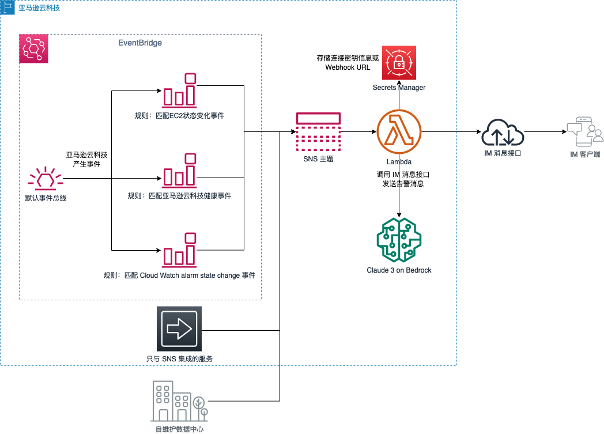

# WeChat-Notifier: WeChat Notification for AWS Events

We occasionally receive notification emails from AWS regarding EC2 maintenance information in our admin mailbox when using AWS. However, these emails can easily get buried in the inbox and may not be addressed promptly. Many customers wish to receive such messages more promptly, such as through instant messaging apps like WeChat or DingTalk.

Instant messaging tools like WeChat and DingTalk provide message interfaces, and third-party applications can send messages to clients by calling these interfaces after obtaining authorization. On AWS, you can configure event rules in EventBridge/CloudWatch Events to trigger a Lambda function to run the logic for calling the WeChat/DingTalk interfaces. There are many blogs and technical articles explaining this design approach, and you can refer to some of the links in the appendix.

This project goes a step further and provides a feature to quickly deploy WeChat alert notifications without writing any code. In the Serverless Application Repository, you can fill in three parameters related to the WeChat interface and quickly deploy a suite of components for WeChat alert notifications. The AWS services involved include EventBridge, SNS, Lambda, and Secrets Manager. The overall deployment architecture is shown below:

For demonstration purposes, this application creates two EventBridge Rules during deployment: one captures EC2 state change events (such as start/stop), and the other captures AWS health events (such as EC2 scheduled maintenance events). Therefore, after deployment, you can check if you receive notifications on WeChat by simply starting or stopping an EC2 instance.

## Deploying this Application in the Serverless Application Repository

You can search for `wechat-notifier` in SAR to find this application. (Note that since this project will create EventBridge to SNS Publish permissions, you need to check the box as shown in the image below.)

## Note

This example directly pushes messages to specified departments and employees through the WeChat Work app.

1. Due to WeChat Work limitations, you need to add the IP address that calls the message sending API to the "Trusted IP" list. Please refer to [this link](https://open.work.weixin.qq.com/devtool/query?e=60020) for more information.
2. To set a fixed egress IP for Lambda, you need to configure a subnet for Lambda, as described [here](https://repost.aws/zh-Hans/knowledge-center/lambda-static-ip).

To simplify the configuration, you can use the `DingTalk-Notifer` branch to configure pushing messages to a WeChat Work group.

LLM-related deployment options:

The LLM parameters are optional, and the default values are shown in the image above. For customizing the System Prompt, please refer to [defaultSystemPrompt](layer/python/claude.py).

## Message Sorting Effect with LLM

Original message:

Sorted message:

## Default Included Notification Events
* AWS Health Event
* AWS Health Abuse Event
* EC2 Instance State-change
* CloudWatch Alarm State Change

## Acknowledgments

This project is based on Niko Feng's WeChat Work integration [project](https://github.com/nikosheng/wechat-lambda-layer-sam) and Randy Lin's SAR deployment [project](https://github.com/linjungz/wechat-notifier.git), with modifications for WeChat integration and deployment template implementation. We would like to express our gratitude to Niko and Randy!

## Update History

2021-03-25:
Adjusted the SNS Access Policy. The permission was changed from only allowing EventBridge in the same account as SNS to publish messages, to allowing all AWS services in the same account as SNS to publish messages. This facilitates users to set event notification alerts from other AWS services like RDS and notify WeChat.

2022-10-16:
Added AWS Cost Anomaly Detection integration.

2022-11-2:
Added Amazon GuardDuty integration.

2023-02-28:
1. Converted AWS service integration to a plugin-based approach. Please refer to the [project: AWS-Lambda-notifier-plugin](https://github.com/Chris-wa-He/AWS-Lambda-notifier-plugin) for more information.
2. Added Cloud Watch alarm state change as a default rule.
3. Removed AWS Cost Anomaly Detection & Amazon GuardDuty integration, which has been moved to the [project: AWS-Lambda-notifier-plugin](https://github.com/Chris-wa-He/AWS-Lambda-notifier-plugin).

2023-06-2:
Added Event Bridge name and SNS ARN as outputs for easier integration as plugin parameters.

2023-06-14:
Added capturing AWS Health Abuse Event as a default event.

2024-05-16:
Added the ability to connect to the Bedrock-managed LLM for information sorting.

2024-12-11:
Use the Converse API to call Bedrock models. The default usage model is tuned to Amazon Nova Lite.

## Appendix

[AWS Blog: Enable WeChat/DingTalk Alarm Notification with One-Click Based on AWS Serverless](https://aws.amazon.com/cn/blogs/china/enable-wechat-dingtalk-alarm-notification-with-one-click-based-on-aws-serverless/)

[AWS Blog: Enterprise WeChat and DingTalk Receiving Amazon CloudWatch Alarms](https://aws.amazon.com/cn/blogs/china/enterprise-wechat-and-dingtalk-receiving-amazon-cloudwatch-alarms/)